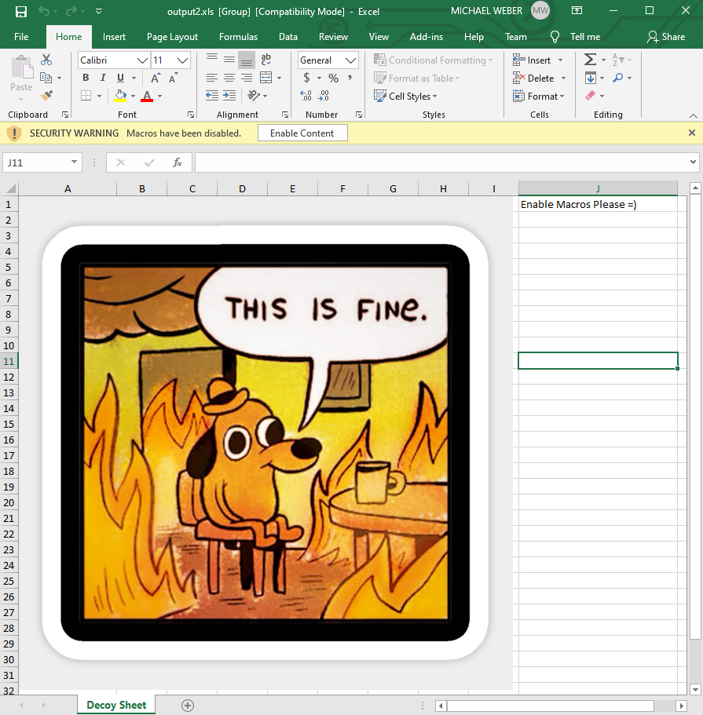

# Macrome
An Excel Macro Document Reader/Writer for Red Teamers & Analysts. A corresponding blog post describing what this tool actually does can be found [here](https://malware.pizza/2020/05/12/evading-av-with-excel-macros-and-biff8-xls/).

# Installation / Building
Clone or download this repository, the tool can then be executed using dotnet - for example:

~~~
dotnet run -- build --decoy-document Docs\decoy_document.xls --payload Docs\popcalc.bin
~~~

or 

~~~
dotnet build
cd bin/Debug/netcoreapp2.0
dotnet Macrome.dll deobfuscate --path obfuscated_document.xls
~~~

# Usage
Run Macrome by either using `dotnet run` from the solution directory, or `dotnet` against the built Macrome binary. There are two modes of operation for Macrome - Build mode and Deobfuscation mode. 

## Build Mode
Run Macrome with the `build` command in order to generate an Excel document containing an obfuscated macro sheet using a provided decoy document and macro payload. `dotnet Macrome.dll build -h` will display full usage instructions.

For example, to build a document using decoy document `path/to/decoy_document.xls` and binary x86 shellcode stored at `path/to/shellcode.bin`, run `dotnet Macrome.dll build --decoy-document path/to/decoy_document.xls --payload /path/to/shellcode.bin`. This will generate an XLS 2003 document which after being opened and having the "Enable Content" button pressed, will execute the shellcode of `shellcode.bin`.

### Binary Payload Usage
First generate a base "decoy" Excel document that will contain content users should see. This should be some sort of lure that convinces users to click the "Enable Macros" button displayed in Excel. There's some examples of the "latest and greatest" lure creation at https://inquest.net/blog/2020/05/06/ZLoader-4.0-Macrosheets-. Once this sheet is created, save the document as type `Excel 97-2003 Workbook (*.xls)` rather than the newer `Excel Workbook (*.xlsx)` format. An example decoy document is included in `/Docs/decoy_document.xls`.

Next, generate a shellcode payload to provide to the tool. The example binary payload (which pops calc) was generated using `msfvenom` using the following parameters:

~~~
 msfvenom -a x86 --platform windows -p windows/exec cmd=calc.exe -e x86/alpha_mixed -f raw EXITFUNC=thread > popcalc.bin
~~~

Note that using a majority alpha-numeric payload will reduce the size of the macro file generated since it's easier to express letters and numbers in macro form instead of appending `CHAR` function invocations repeatedly like `=CHAR(123)&CHAR(124)&CHAR(125)...` etc. But the tool should be able to handle a completely unprintable binary payload as well.

Currently this will only work with `x86` payloads, but `x64` support is coming soon, along with support for loading .NET binaries.

### Macro Payload Usage
Similar to binary payload usage, a decoy document must first be generated. Next, a text file containing the macros to run should be created. Macros should be separated by newline characters and will be written to column B starting with row 1. A basic example macro is provided in `/Docs/macro_example.txt`.

Finally run the command:

~~~
dotnet Macrome.dll build --decoy-document decoy_document.xls --payload macro-example.txt --payload-type Macro
~~~

Note the usage of the `payload-type` flag set to `Macro`. 

## Deobfuscate Mode
Run Macrome with the `deobfuscate` command to take an obfuscated XLS Binary document and attempt to reverse several anti-analysis behaviors. `dotnet Macrome.dll deobfuscate -h` will display full usage instructions. Currently, by default this mode will:

* Unhide all sheets regardless of their hidden status
* Normalize the manually specified labels for all `Lbl` entries which Excel will interpret as Auto_Open entries despite their name not matching that string.

For example, to deobfuscate a malicious XLS 2003 macro file at `path/to/obfuscated_file.xls`, run `dotnet Macrome.dll deobfuscate --path path/to/obfuscated_file.xls`. This will generate a copy of the obfuscated file which will be easier to analyze manually or with tools.

*NOTE*: This doesn't do very much yet, it's mainly meant to demonstrate how using the modified b2xtranslator library can help automate deobfuscation. More useful features are coming soon. 

# Acknowledgements 
Big thanks to all the shoulders that I was able to stand on in order to write this.

* https://outflank.nl/blog/2018/10/06/old-school-evil-excel-4-0-macros-xlm/ - The Outflank team created this attack, I'm just automating some of the tedious parts.
* The folks at InQuest for their excellent write-ups on what malware authors are doing to evade detection right now.
  * https://inquest.net/blog/2019/01/29/Carving-Sneaky-XLM-Files
  * https://inquest.net/blog/2020/03/18/Getting-Sneakier-Hidden-Sheets-Data-Connections-and-XLM-Macros
  * https://inquest.net/blog/2020/05/06/ZLoader-4.0-Macrosheets-
* [@DissectMalware](https://twitter.com/DissectMalware/) for their killer [XLMMacroDeobfuscator](https://github.com/DissectMalware/XLMMacroDeobfuscator) tool which has been awesome to test against and is just a really great piece of tech if you're on the defense/analyst side.
* The original authors of the `b2xtranslator` library as well as the folks at EvolutionJobs who updated it and ported it to dotnet. The code used here was initially sourced from https://github.com/EvolutionJobs/b2xtranslator.
* Imagery taken from KC Green's comic at https://gunshowcomic.com/648
